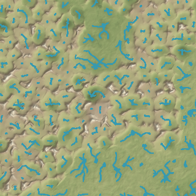
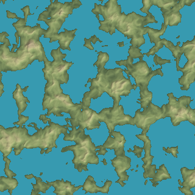
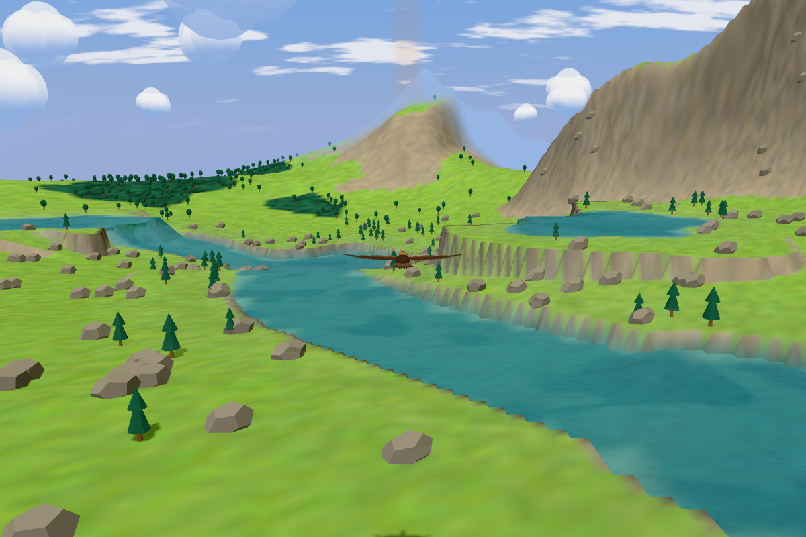
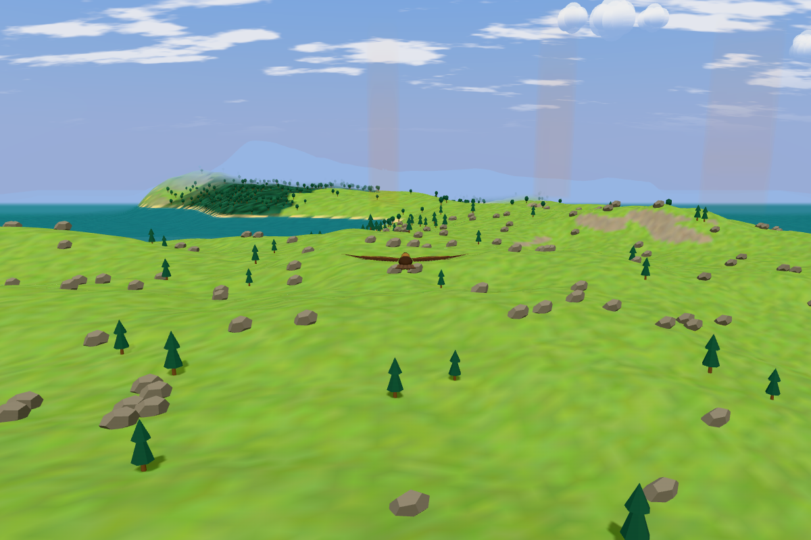

# Continental land and sea-level basins

The captain selected option C: replace Soaring's land and lakes with Fly-with-me's continental generator. The source reference is FWM [`aca247b487ffafa5696cce143f108a71a24a7950`](https://github.com/kunchenguid/fly-with-me/tree/aca247b487ffafa5696cce143f108a71a24a7950), `src/main.js:327–366` and `src/noise.js`.

## Generator

`WorldModel.sample` remains the world-coordinate contract for rendering, vegetation, thermals, flight, audio and mist. Terrain uses Soaring's existing deterministic hash and gradient-noise implementation. All three field seeds derive from the world seed, with FWM's field keys.

The port keeps FWM's construction:

- 700 m coordinate warp at 2.2 km, with continentalness at 3.4 km.
- `smoothstep(0.4, 0.6, continentalness)` determines land.
- 520 m hills range from 10 m offshore amplitude to 48 m on land.
- `smoothstep(0.56, 0.82, continentalness)` masks mountains.
- A second 260 m warp feeds the 1.6 km ridged massif, with 640 m amplitude.
- Three/four-faced pyramid candidates use 2.4 km cells, 850 m radius, power 1.7, and up to 900 m lift.
- Height starts at `-70 + 150 * land + hills + mountainLift`.
- The global shelf is `h * (0.55 + 0.45 * smoothstep(-30,30,h)) - 6 * (1 - smoothstep(-30,30,h))`.
- Every below-zero basin fills to sea level, 0 m. Bays and islands emerge from this same field.

Two deliberate differences from FWM remain. Noise uses Soaring's hash rather than FWM's hash, so equal seeds do not yield equal maps. Pyramid feet retain Soaring's smooth cutoff and zero-preserving soft maximum. These remove the discontinuities in FWM's candidate cutoff without changing face construction or height coefficients.

## Climate and content

Soaring keeps its 28 km climate scale, field warp, altitude lapse, five biome rules and existing palettes/content. Highlands and Lakeland retain their previous selection fields. Mountains now follow continentalness rather than a biome-owned elevation profile, so mountain geometry and the Highlands appearance region need not coincide everywhere. Final shelved height determines temperature.

Biome profiles no longer contain height offsets or amplitudes. Woodland glades, Hills parcels/hedges, Moor tors/heather, tree species, snow thresholds, ambience and thermal preferences remain. There are no explicit lake-island objects or guaranteed elliptical Lakeland lakes. Natural dry islands use the surrounding biome's ordinary vegetation.

## Water and flight adapter

`surface` is always 0 m. `water` means `height < 0`. `bank` is a signed local tangent-plane distance estimate for vegetation clearance and mist/moisture. It is not an exact distance to the nearest global coast. Flight shore queries instead search bounded rays for actual height-zero crossings and follow their dry-side normals.

Water uses each rendered terrain tile's vertices and triangle diagonal. The shader interpolates signed depth on those same triangles and discards fragments at nonpositive depth. This follows the actual rendered coast rather than clipping a separate 36 m water lattice. Every water vertex stays at 0 m; no local level, dry-corner averaging or render-height offset remains. Sand fades from the existing beach colour to the biome colour between 1.5 and 7.5 m ground height.

The water material, jade depth colours, transparency, ripples and sun/moon glints remain Soaring's. This task does not adopt FWM's opaque reflections or change the terrain renderer's coverage/LOD architecture.

The first one-hour flight exposed 58 collision-floor corrections. The old climb and movement checks were gated by Highlands biome weight. Continental mountains can stand outside that biome. Those safety checks now follow terrain and sea level on every route. The six-metre safety margin and the existing flight acceptance limits remain unchanged.

## Removed

- The 500 m drainage lattice, node jitter, downstream routing, flow counts, confluence levels and two drainage caches.
- River reaches, widths, meanders, crossing prevention, channel beds, valley cones and tributary protection.
- Drainage basin/Lakeland ellipses, explicit island domes, elevated cirques and their bowls.
- Elevated Moor peat pools and their local shelves. Common sea level is the sole water source.
- Lowland biome height offsets/amplitudes and river-dependent landmark/capture APIs.
- River-only assertions and old drainage fixture assumptions. Generic reliability, placement, seams and all flight safety checks remain.

Historical diagnostic boards and measurements are preserved as historical evidence, not rewritten as results for this generator.

## Matched evidence

Both maps use seed 42, bounds x,z = [-12,000,+12,000] m, 320² samples at 75 m, identical absolute height colours and hill shading. They exclude product colours and atmosphere.

Before: 8.89% sampled water. After: 49.49% sampled water. These describe this window only, not global coverage.

The chase-camera captures use seed 42, position (2000,2000), heading 0, noon, 3000 m requested terrain visibility, the normal `?profile` renderer, and a 1200×800 viewport. Chase height follows the changed terrain. The same horizontal pose is retained; the eagle is not moved to a flattering new location.

Reproduce the map with `node scripts/capture-terrain-map.mjs after`. Browser capture instructions and test modes are in [testing](../testing.md). The browser E2E tests write JSON evidence for geography, triangle depths, placement, climate and the one-hour Highlands flight.
