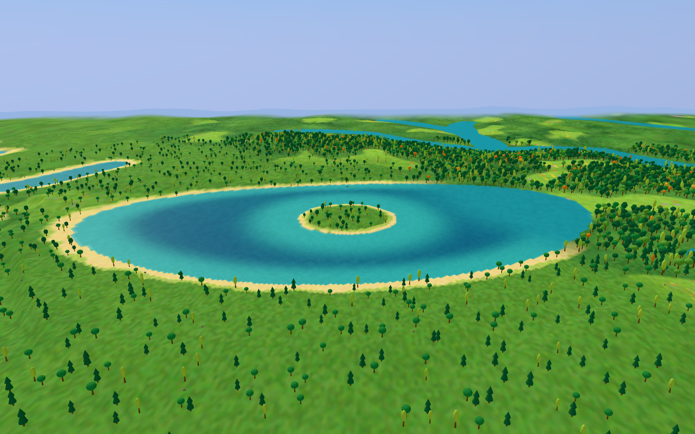
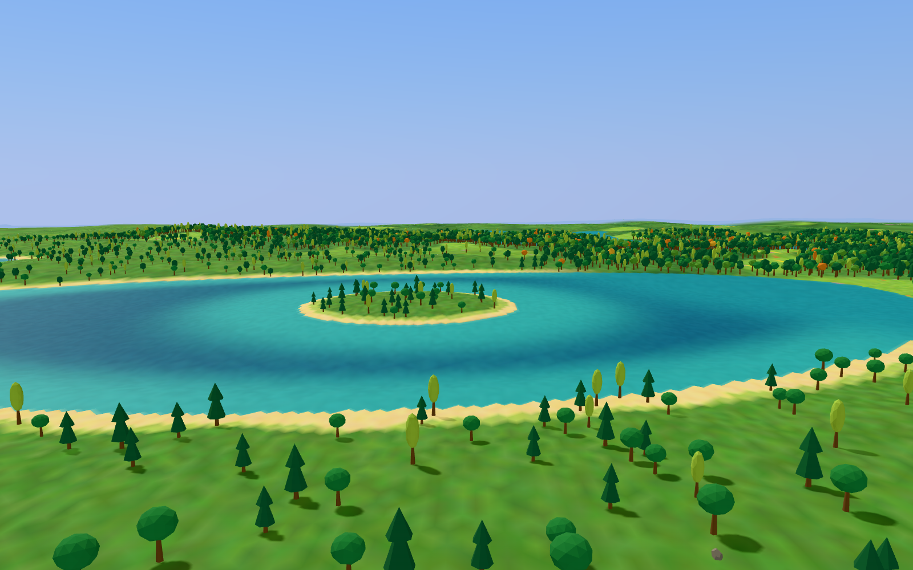

# Lakeland validation

## Repeatable checks

```sh
npm run check
npm run test:smoke
node scripts/calibrate-lakeland.mjs
node scripts/audit-lakeland.mjs
```

The browser suite produces `test-results/smoke-timings.json` and attached screenshots/JSON. The two scripts produce `test-results/lakeland-calibration.json` and `test-results/lakeland-audit.json`. Run the scripts after Playwright, which clears its output directory.

## Territory

The calibration samples a 120 km square at 2 km spacing, 3,721 points per seed. Water is excluded from the land denominator. Both fractional biome coverage and dominant coverage are measured. The selected lake-field threshold is 0.75, with the existing 0.12-wide smooth transition. The field uses four fbm octaves at 7,000 m, seed offset 131, and low-relief eligibility below 0.4.

At the selected threshold:

| Seed | Dry samples | Weighted Lakeland | Dominant Lakeland (>0.5) |
| --- | ---: | ---: | ---: |
| 448122 | 3415 | 12.07% | 11.98% |
| 80231 | 3396 | 16.62% | 16.61% |
| 5914 | 3322 | 17.87% | 17.85% |

These are measurements over three grids, not a guarantee that every finite seed window has the same proportion. The committed calibration script also measures thresholds 0.735 and 0.765 to make the choice reviewable.

## Landform and ownership

Lakeland replaces the existing biome appearance and basin water. It does not change pre-#59 drainage elevations, Hills' 150 ±75 m profile, river routing, water levels or river carving. The same ordered biome allocator is used with the lake field disabled to retain the accepted landform, and enabled to select appearance.

Expanding a basin disc without checking higher tributaries produced lake cliffs and flooded banks. The lake mask now excludes higher water features with a clearance of `348 + 3 × levelDifference` metres. The 348 m base keeps lake ownership changes outside the accepted 150 m river shelf. The original river inlet radius remains unchanged. The river-wall test samples a larger 20 km window and retains its maximum slope below 3. The far-grid river check excludes lake-covered centers and lake-covered side probes, since a lake shore is not a river bank.

The browser suite includes a regression for seed -1214809889, whose largest nominal basin has no visible lake after tributary protection. Hydrology viewpoints now search for actual water and fall back to the next visible feature, rather than returning an island or an empty lake mask. Three additional fresh random-world hydrology runs passed without retries. The merged branch passes all 52 unit/integration tests, type/build validation and all 20 browser smoke tests; `issue-59/validation.json` records the results.

The water mesh uses one world-aligned 36 m grid at every terrain tier. Dry vertices use a fixed-neighborhood water level, capped below dry ground after the 0.15 m render offset. The browser test compares actual water heights and colours at shared near/mid/far edges, with zero error. Water materials remain plain; this branch adds no glints.

## One-hour navigation

The audit starts beside a real lake at `(7647.127558763605, -11252.509786414448)` in seed 448122. The lake has a nominal 1,884.5 m major diameter, a wooded island, and a measured water span of about 1,800 m. All 32 probes around the island lie in water. The browser test records 41 island trees and 40 shared water vertices with zero seam error. Committed JSON evidence is in `issue-59/browser.json`, `issue-59/calibration.json` and `issue-59/navigation.json`.

The audit runs 36,000 navigation updates at 0.1 s:

- Travel: 101,613.3 m; displacement: 48,135.0 m, above the retained 35% requirement.
- Longest uninterrupted water crossing: 1,104.0 m.
- Water updates: 4,180; minimum clearance above land or water: 86.58 m.
- Flapping: 101.6 seconds. Behavior time: 2,050.4 seconds gliding, 793.8 seconds seeking thermals, 744.6 seconds riding thermals, and 11.2 seconds ridge soaring.
- Old-route returns after ten minutes: zero, below the retained maximum of five.
- 100 scenic starts are on land; all sampled nearby thermal placements are on land.

This is a simulated hour, not a literal one-hour browser soak. The full navigation suite still checks all three altitude bands, clearance, thermal/ridge climb ceilings and behavior duration. The lake-aware scenic reach extends to about 2 km; existing flap energy supports crossing without water thermals.

## Reconciliation with biome-aware flight

The branch merges main commit `5394f8947968b521390ee554c8fbfb49d39b4637`, preserving accepted ridge soaring, shore tracing, glade/tor scoring and valley routing. The shared shoreline helper now follows Lakeland ellipses as well as ordinary discs. All 32 tested landward shoreline targets are dry; the featured lake's minor-axis shoreline radius is 553.0 m.

The combined flight initially exceeded an old total-flapping ceiling. The user explicitly rejected that criterion: the bird may flap as much as needed. Only total flap ceilings were removed from navigation and Highlands tests. Safety, travel, episode duration, thermal/ridge no-flap behavior, climb bounds and water exclusions remain checked. Lakeland `thermalOdds` remains 1; accepted shore tracing remains enabled. No production behavior was changed to hide the flap increase.

`issue-59/navigation-default.json` records the default scenic-start hour: 103.90 km traveled, 48.82 km displacement, 199.7 seconds flapping, no stalls and no old-route returns. `issue-59/highlands-navigation.json` records the browser Highlands hour: 275.9 seconds flapping, minimum clearance 12.40 m, peak vertical speed 4 m/s, zero safety corrections, two ridge episodes totaling 420.2 seconds, zero ridge flapping or ceiling breaches, and a longest behavior episode of 210.1 seconds. Historical baseline flap time is reference data, not a limit.

## Screenshots

The screenshots were captured through `chrome-devtools-axi` at 1600 × 1000, noon, 5 km visibility, normal rendering, shadows enabled and adaptive quality step zero. Thermal markers are hidden. These are development review poses, not a changed chase camera.

Set the stored seed to 448122, reload the development app, then:

```js
window.__SOARING__.setTimeOfDay(.5);
window.__SOARING__.reviewFlight({ x: 7647.127558763605, z: -11252.509786414448, heading: 1.001 });
window.__SOARING__.setViewpoint({ x: 6547, y: 630, z: -9952, lookX: 7647, lookY: 85, lookZ: -11252 });
```

Wait for `snapshot().pending === 0` and a newly rendered frame.



For the shore view:

```js
window.__SOARING__.setViewpoint({ x: 6970, y: 245, z: -10430, lookX: 7850, lookY: 90, lookZ: -11350 });
```


