# Issue #93: climate-selected biomes

The captain approved these climate points, a 28 km scale, and full altitude cooling on 2026-10-03 through the Lavish review. Highlands remains tied to the mountain field. Lakeland remains tied to the lake field. No biome profiles, palettes, species or content generators changed.

## Selection

| Biome | Temperature | Moisture | Region | FWM analogue |
| --- | ---: | ---: | ---: | --- |
| Hills | 0.56 | 0.36 | 0.45 | wildsong meadow |
| Woodland | 0.42 | 0.70 | 0.55 | elderwood forest |
| Moor | 0.24 | 0.40 | 0.40 | moor heath |

These are points on the stretched axes, not raw noise values. The triangle avoids placing Hills in a thin strip between Woodland and Moor. Fields use FWM's two-octave gradient noise, 900 m coordinate warp, and relative wavelengths of 1 / 0.8 / 0.9. The temperature wavelength is 28 km rather than FWM's 12 km to meet the existing span target.

The field seeds derive from hashes of the world seed. As in FWM's implementation at `aca247b`, moisture uses the hashed temperature seed plus 3, while region uses a separate hash plus 19. This removes the former equality between one world's Hills field and a nearby world's climate field.

Highlands and Lakeland claim their existing territories first. The three climate biomes share the remainder using `exp(-2.2 × (distance² - nearest distance²))`, with distances divided by `0.12²` and axes stretched by 2.2. The weights sum to one.

Temperature falls by one every 2,600 m. Selection uses a single uncarved broad height estimate to avoid a cycle between biome profiles, height and drainage. It excludes #86's ground-only hills: cooling from those hills must not change the broad profile and feed the hill shape into drainage. The rendered ground still adds hills and peat shelves. Snow, scree and the tree line use temperature at the final ground height. Their thresholds retain the former height bands at sea-level temperature 0.5. Cold massifs can have snow much lower than warm massifs.

## Coverage and median spans

Reproduce from the repository root:

```sh
node scripts/audit-biome-spans.mjs
node scripts/audit-biome-spans.mjs --ref 17ed32f
```

Each cell reports mean weight coverage followed by median span. Lakeland has coverage only. The committed raw reports are [after](biome-spans.json) and [before](biome-spans-before.json).

| Seed | Hills | Woodland | Moor | Highlands | Lakeland |
| --- | --- | --- | --- | --- | --- |
| 80231 | 20.0% / 7.2 km | 26.4% / 9.1 km | 20.5% / 6.6 km | 17.0% / 9.1 km | 16.1% |
| 42 | 20.6% / 7.4 km | 26.3% / 8.6 km | 22.6% / 6.0 km | 16.2% / 8.5 km | 14.3% |
| 123456 | 19.3% / 7.4 km | 27.2% / 9.0 km | 22.3% / 7.1 km | 17.6% / 9.2 km | 13.6% |

The audit samples a 240 × 240 km window. Coverage uses pre-drainage weights on a 500 m grid. Spans measure the dominant landform biome along east-west flight lines spaced 1.5 km apart, sampled every 100 m. Runs touching either window edge are excluded.

The landform allocation reserves no lake territory. Using appearance weights for spans would label Lakeland cores as Hills because all four land weights are zero. The audit now exposes the existing landform allocation in older bundled revisions too, so before and after use the same metric. Lakeland's unchanged 7 km lake field is not a contiguous land-biome span.

## Approval maps

Each map covers 120 × 120 km at 200 m per pixel. North is at the top. Colours blend the biome weights: green Hills, dark green Woodland, purple Moor, grey Highlands, and blue Lakeland.

| Seed | Before | Approved selection |
| --- | --- | --- |
| 80231 | 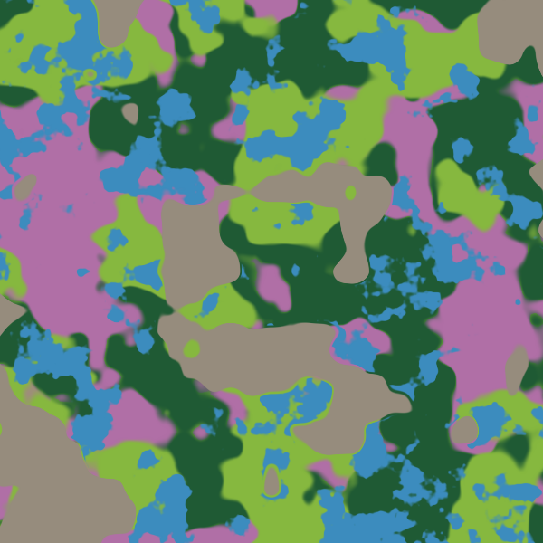 | 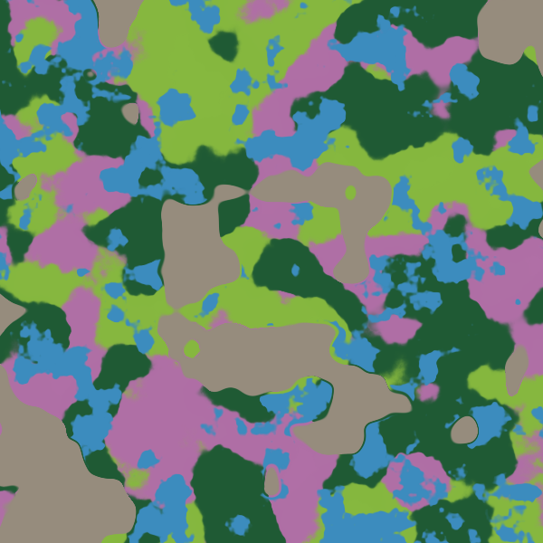 |
| 42 | 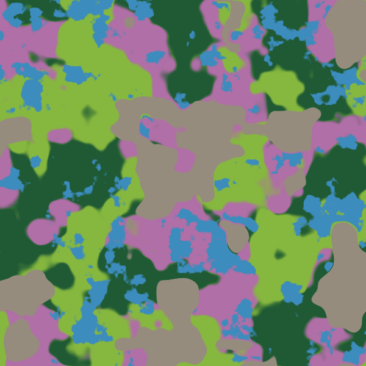 | 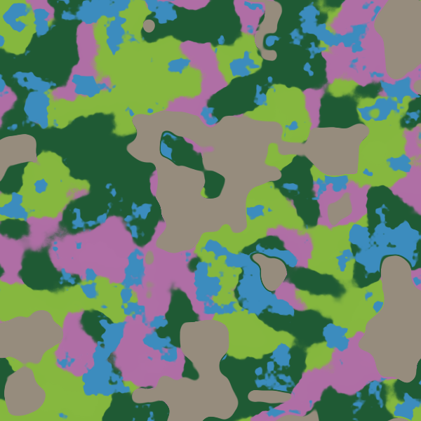 |
| 123456 | 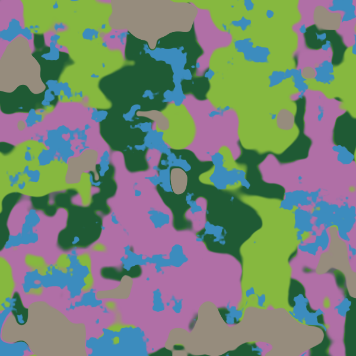 | 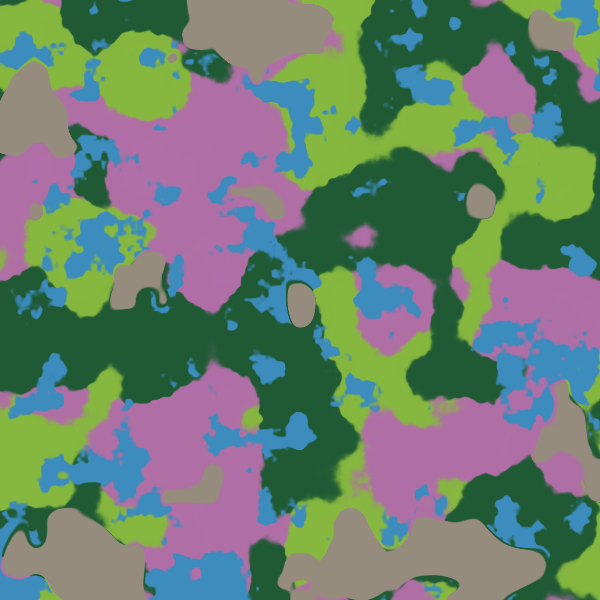 |

Reproduce a map on macOS, where the script uses `sips` to encode PNG:

```sh
node scripts/biome-map.mjs 80231 --tag proposed
node scripts/biome-map.mjs 80231 --ref 17ed32f --tag main
```

## Same-vantage screenshots

These captures use normal development rendering, shadows, a 1440 × 900 viewport, noon, and 1,800 m terrain visibility. They do not use reduced-resolution smoke mode. Before uses `17ed32f`, including merged ground-only hills, shared pools and puff clouds. The fixed world camera and look target are identical within each pair. Heights and drainage can change with the climate-selected profile, so the eagle can move within the frame.

| Biome | Before | After |
| --- | --- | --- |
| Hills |  | 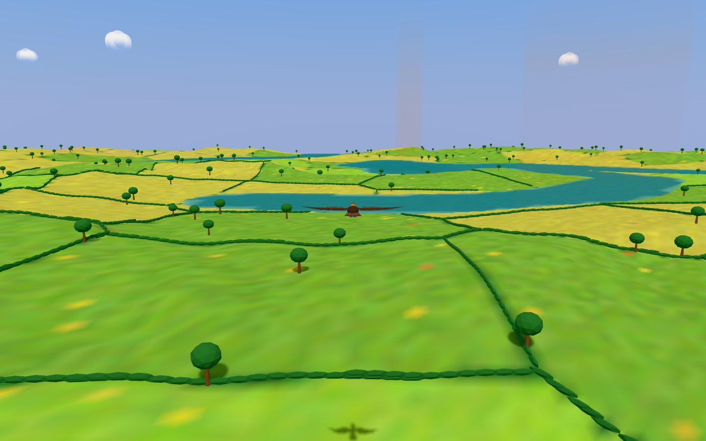 |
| Woodland | 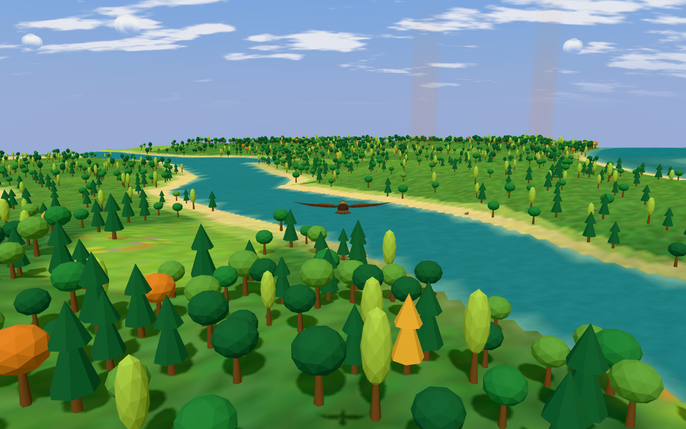 | 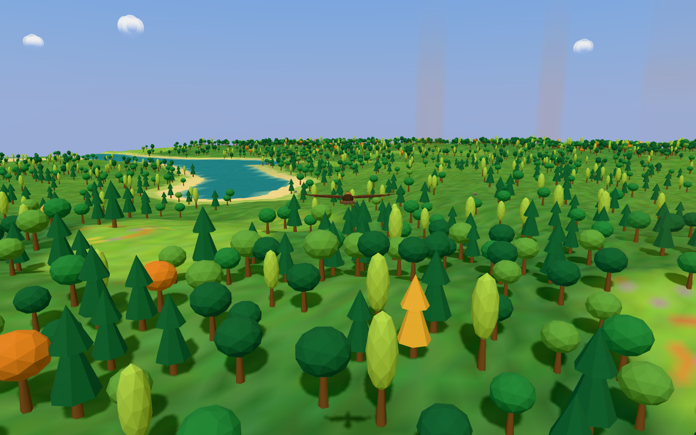 |
| Moor | 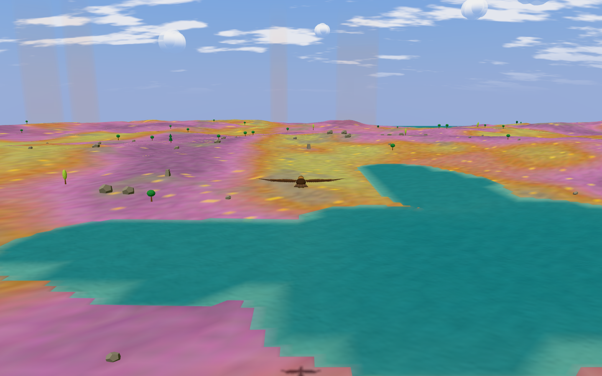 | 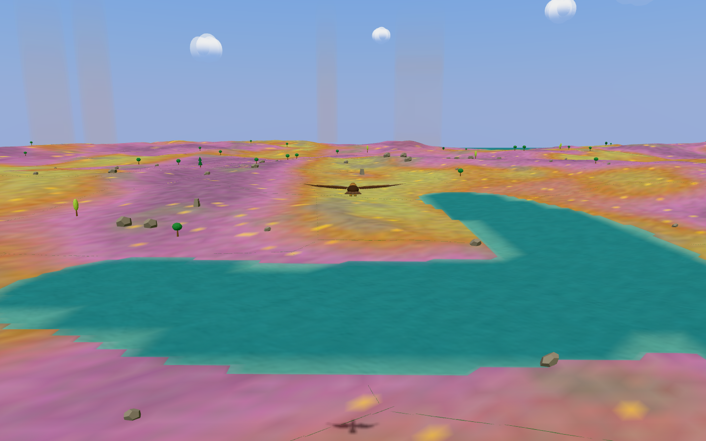 |
| Highlands | 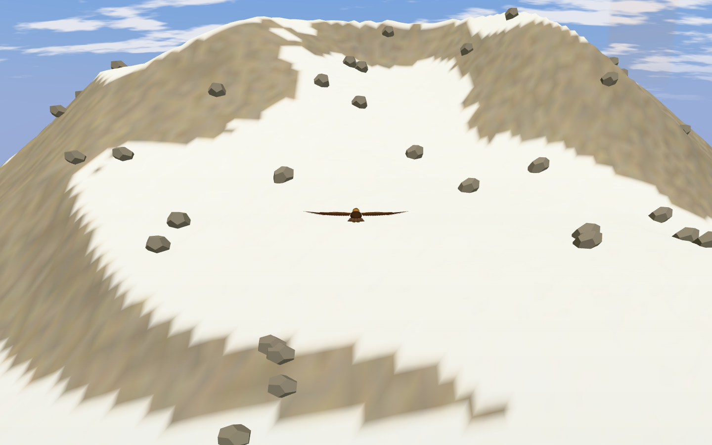 | 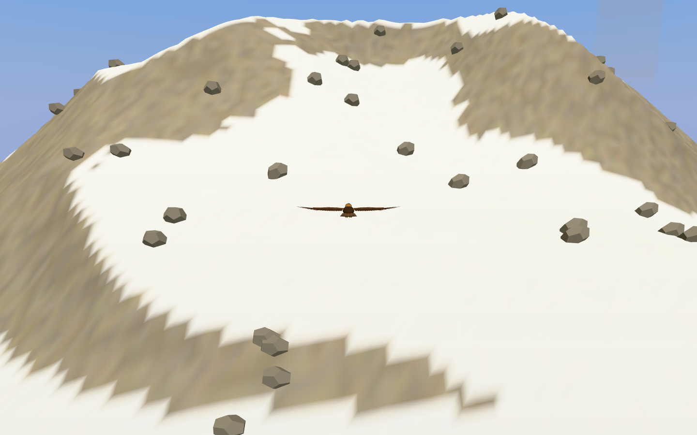 |
| Lakeland | 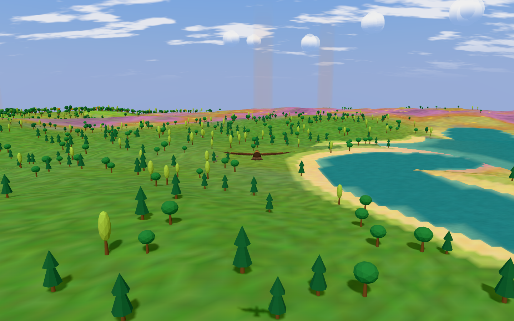 | 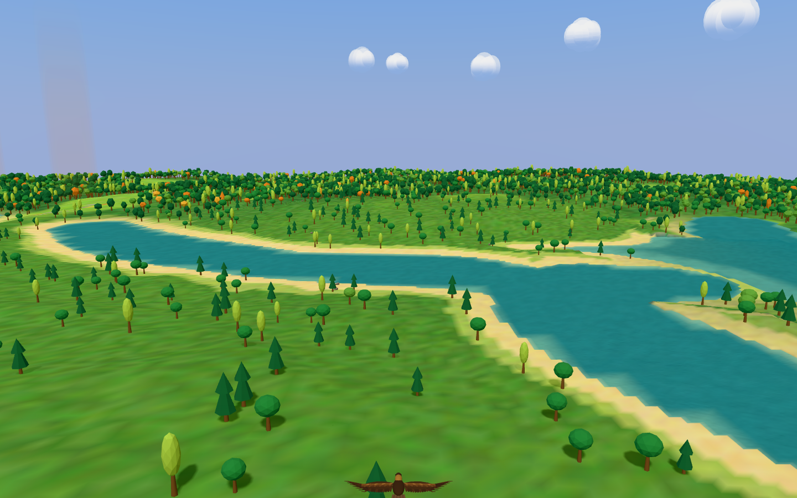 |
| Hills/Woodland blend | 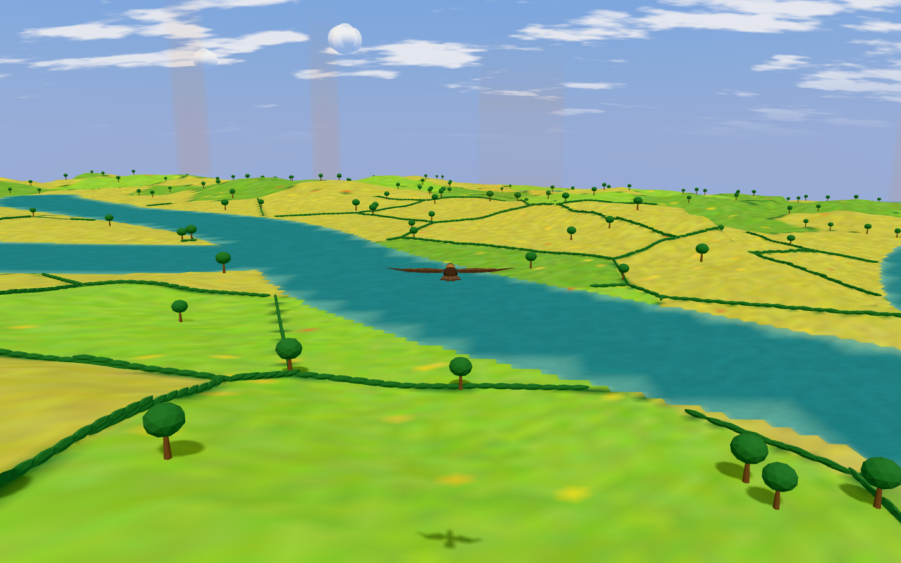 | 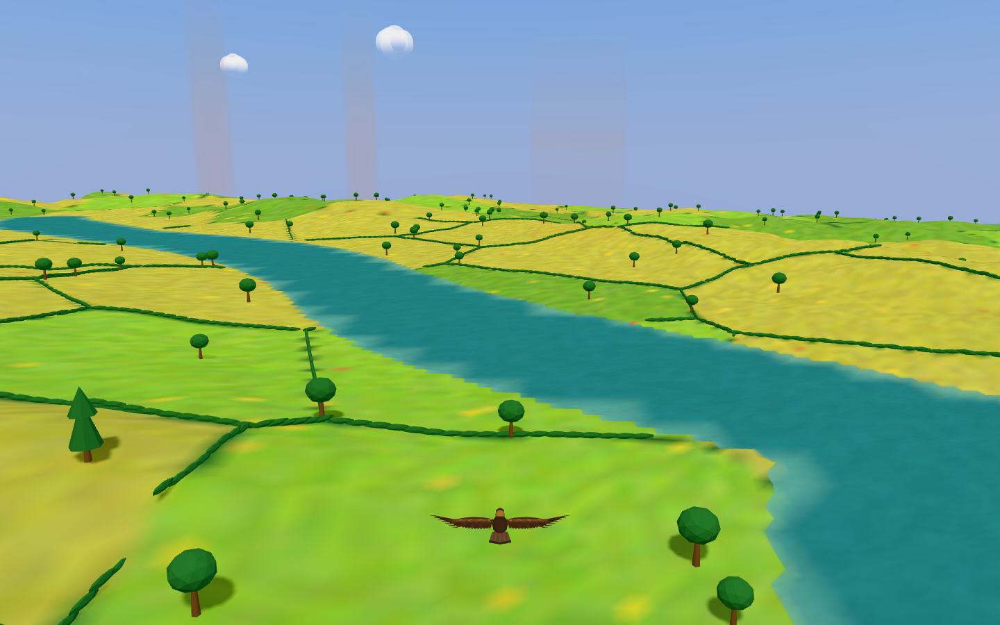 |

[Capture poses](capture-poses.json) record the seed and eagle start. [Cameras](cameras.json) record exact world coordinates. Set the world seed in `localStorage` before reload. Then call the development API:

```js
const app = window.__SOARING__;
app.setTimeOfDay(0.5);
app.setVisibility(1800);
app.setCaptureClear(true);
app.reviewFlight(pose); // Select the named pose from capture-poses.json.
app.setViewpoint(camera); // Select the same named camera from cameras.json.
```

Wait for `app.snapshot().pending === 0` for four consecutive 250 ms checks before taking the screenshot. The Highlands pair uses the baseline default chase camera coordinates, not an elevated or orbit camera.

## Validation and related fixes

- Serial unit validation (`npm run test -- --maxWorkers=1`) passes all 57 tests. TypeScript and production build pass with `npm run build`.
- The full one-worker software-WebGL smoke suite (`npx playwright test -c playwright.chunk-ci.config.ts --workers=1`) passes all 38 tests, including exact shared chunk edges.
- `tests/climate.smoke.ts` writes repeatable climate evidence. It checks point dominance, normalized landform claims, different fields across adjacent seeds, cooling from final heights, cold tree exclusion, and warm/cold snow.
- The snow fixture moved to the nearby taller peak at `(17250, 33000)`. Its former warm peak no longer has full snow under the approved temperature rule. Snow absence now checks warm temperature, not a synthetic height with unchanged temperature.
- After reconciling #86, the one-hour Highlands route starts 500 m west of the original fixture, at `(-84500, 122000)`. A browser counterfactual at the prior climate fixture recorded no ridge episode with hills, but 445.5 s ridge-soaring with only the hill term disabled. The new nearby start records 210.1 s ridge-soaring and 2,613.1 s Highlands exposure. All clearance, climb, ridge and duration assertions remain unchanged. The [counterfactual measurements](hills-route-counterfactual.json) record the real browser replay.
- `tests/lowland-climate.smoke.ts` removes only the hill term in a counterfactual world. It verifies that the hills change ground height but not climate selection, broad elevation or drainage nodes. Cooling still uses final ground height. This preserves the approved drainage separation from #86.
- Overlapping river channels blend their water surfaces by channel depth. Climate-dependent drainage exposed a 13.38 m step at a narrow confluence on seed 448122. The existing valley test measured a slope of 6.69 against its limit of 3. Blending lowers the maximum to 2.52 without weakening that assertion. See the [differential measurements](confluence-slope.json).
