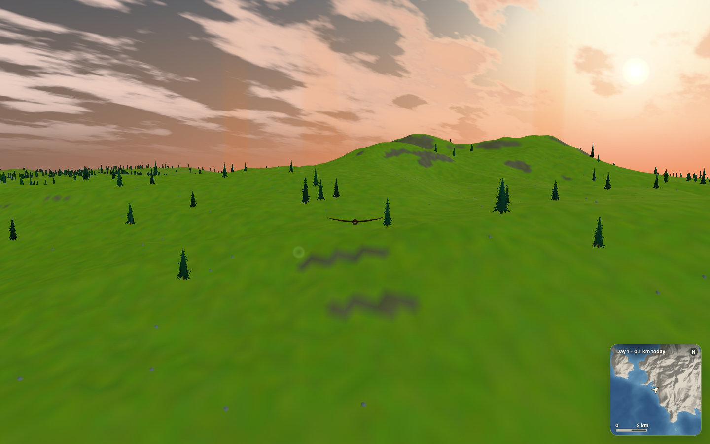
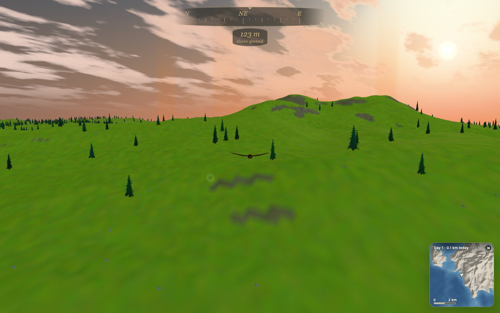
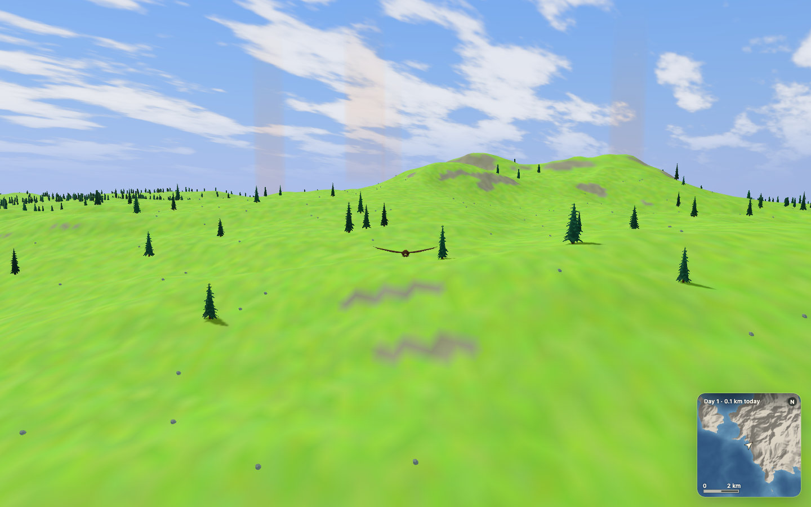
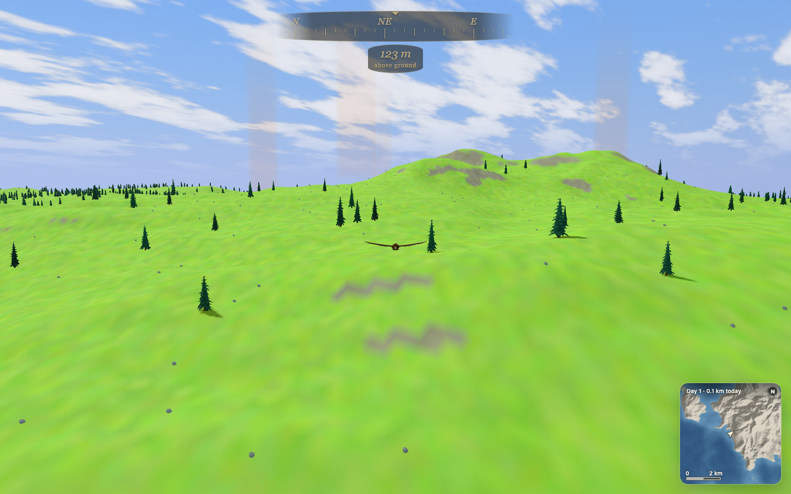
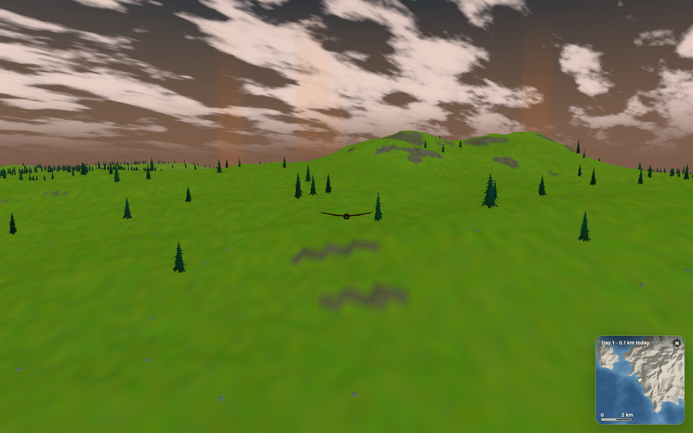
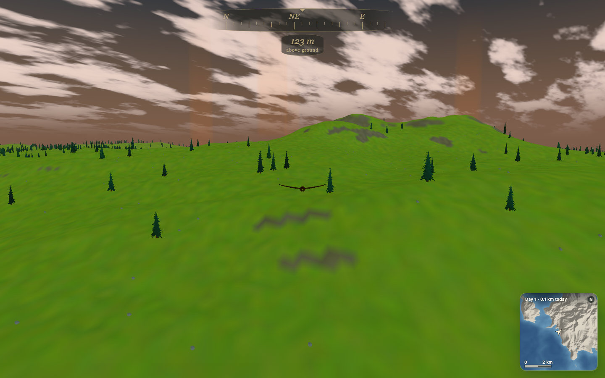
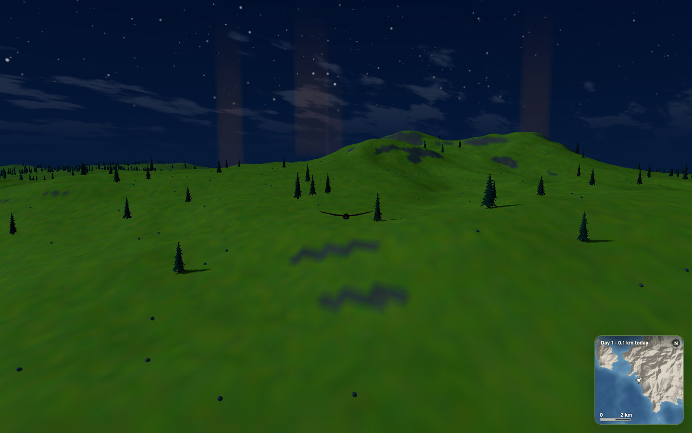
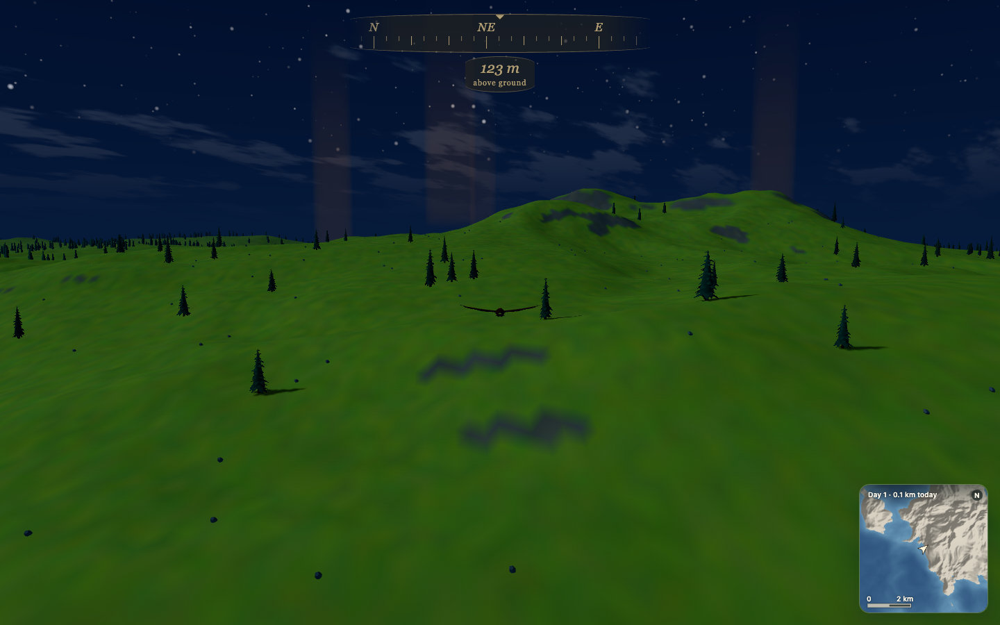

# Field compass captures

The selected field-compass treatment uses warm brass italic lettering, a curved bark-dark strip and an oval height medallion. Its prototype opacities are multiplied by 0.7.

## Before and after

| Light | Before | After |
| --- | --- | --- |
| Morning |  |  |
| Noon |  |  |
| Dusk |  |  |
| Night |  |  |

The before captures hide only the newly added `.flight-hud`. They show the same unchanged engine scene without the new UI. Cloud animation can vary slightly between each pair.

## Repeat the captures

Run `npm run dev`, open `http://127.0.0.1:4173/?profile`, and use a 1440 × 900 viewport. Set seed 5 and reload:

```js
localStorage.setItem('soaring.world-seed.v1', '5');
localStorage.setItem('soaring.scenic-visit.v1', '0');
localStorage.removeItem('soaring.trail.v1');
location.reload();
```

After the reload, hold the default chase view:

```js
const app = window.__SOARING__;
app.reviewFlight({
  x: -37.83081994172982,
  y: 122.71386679160312,
  z: -179.1275973478582,
  heading: Math.PI * .72
});
app.setCloudCoverage(.72);
app.setVisibility(6000);
```

Wait for terrain to draw. Set the light phase with `app.setTimeOfDay(phase)`: morning `.28`, noon `.5`, dusk `.73`, night `.02`. Wait for the new light to render before each capture. The renderer uses normal resolution and shadows, not reduced-resolution smoke mode.

For the before image, set `document.querySelector('.flight-hud').style.visibility = 'hidden'`. For the after image, reset the value to `''`. Capture with `chrome-devtools-axi screenshot <path>`.

The eight 1440 × 900 JPEGs total about 1.04 MiB. They use quality 85 with no chroma subsampling, so the fine brass lettering retains its colour.

## Validation

- `npm run check`: 51 existing tests passed, followed by TypeScript and the production build.
- Seven related browser checks passed: field compass, eagle camera, minimap, nudges and start screen.
- The final field-compass and production browser checks passed after the phone typography and safe-area adjustments.
- The field-compass check saves a bearing trace and screenshots. It verifies all eight map bearings, smooth north crossing, ground/water height, orbit independence, overlay layering and phone/large-desktop widths.
- See [the CI follow-up](ci-follow-up.md) for the branch/main comparison, timeout trace findings and the regression check for unchanged HUD updates.
