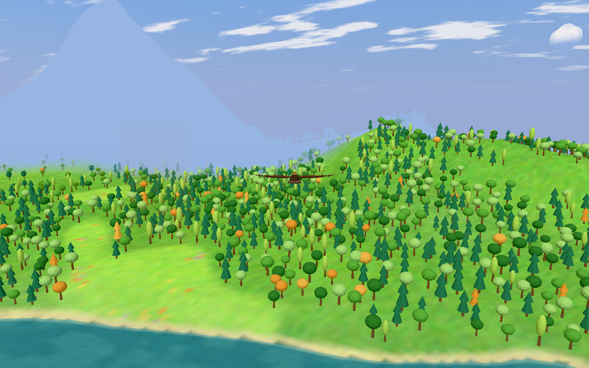
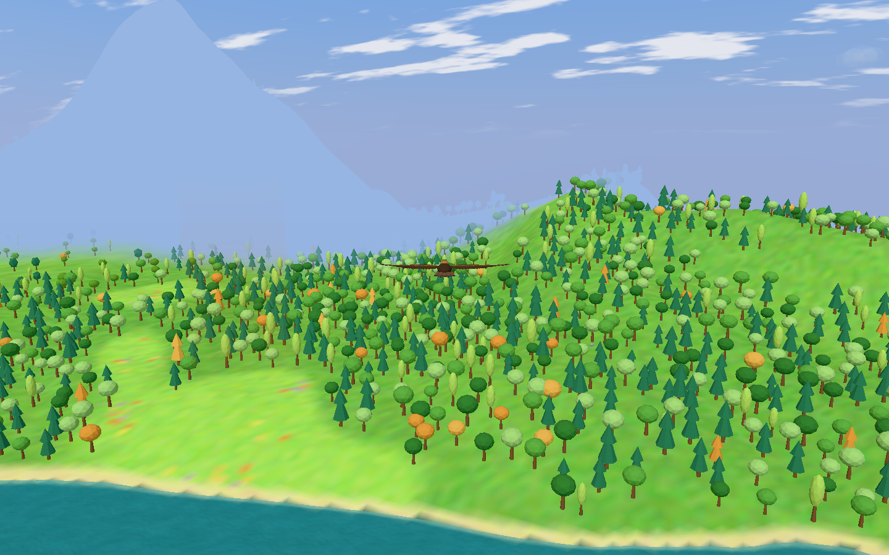
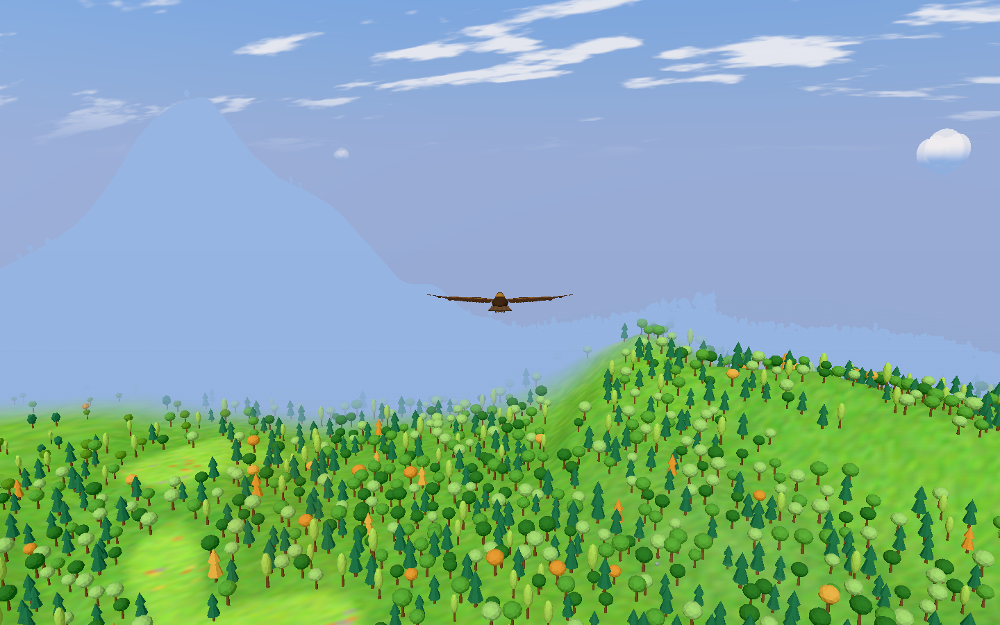
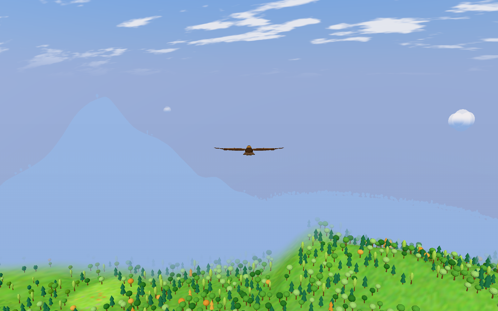
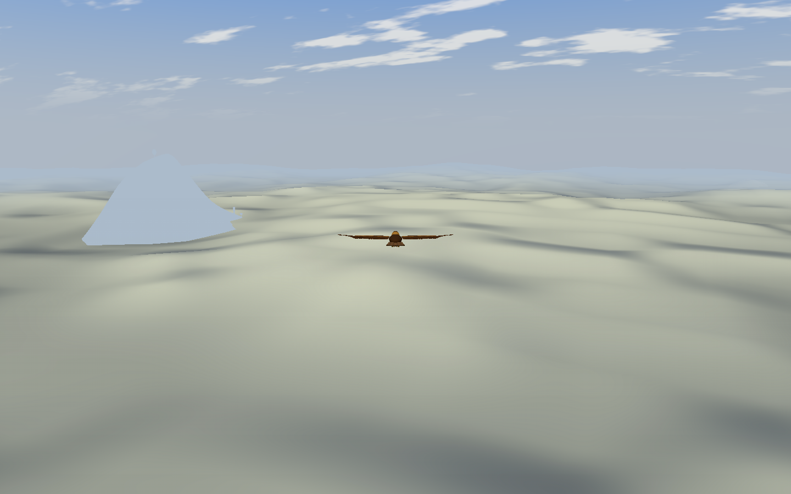

# Coordinated cloud layer

Reference: Fly With Me at `aca247b487ffafa5696cce143f108a71a24a7950`.
The cloud layer now coordinates a surface, camera-height gates, shared fog and
scheduled flight. It replaces the local morning mist rather than stacking two
systems that conceal the same ground.

## What changed

- Below the deck, the surface is not submitted and extra height fog is off.
- Inside, whiteout peaks at 0.996 and applies even to the nearby eagle.
- Above, a uniformly 0.94-opaque sheet and uncapped height fog hide low ground.
  Mountains can still rise out of it. Neither noise holes nor distant alpha
  fading reveal the low terrain.
- Terrain, water, trees, hedges, rocks and the eagle share the same fog formula.
  Thermal markers and puffs fade out in whiteout. Puffs receive the camera-height
  gate.
- The sea paints folds from sun and moon direction. The existing sky palette and
  horizon probe provide the colours. Only the cloud-related horizon veil and
  star suppression change the sky. No sky-dome or moon geometry was changed.
- Cloud motion and the crossing schedule use flight time, so a held review flight
  stops their motion. The day clock remains real-time, as before.

## Adaptations

Soaring already places puffs at 600 m. Keep that deck and multiply FWM's spatial
cloud offsets by `600 / 520 = 15 / 13` instead of moving the existing puff layer.

| Rule | Soaring world height |
| --- | ---: |
| Logical deck | 600 m |
| Mesh origin | 536.538 m |
| Above gate starts / completes | 496.154 / 634.615 m |
| Whiteout starts / peaks / ends | 484.615 / 576.923 / 669.231 m |
| Puff gate starts / completes | 323.077 / 507.692 m |
| Height fog ceiling | 565.385 m |
| High cruise | 819.231 m, with scaled ±30 m noise coefficient |

The noise amplitudes, noise wavelength, normal sampling span and sea footprint
use the same spatial scale. Ordinary fog density divides by that scale. Height
fog uses scaled fragment height and forward depth, equivalent to dividing its
density by the square of the scale. Keep FWM's 0.94 opacity, 0.996 whiteout,
sun/moon gates, 0.5/s schedule easing and fog maximum unchanged. Keep FWM's
12% exposure reduction above the deck. Night exposure, hemisphere light and
puff sky light keep the rules from #128. Puff opacity uses FWM's 0.8.
Ordinary low air uses the pinned source's linear 0–120 m distance ramp.

Keep Soaring's safe 32 m/s cruise and 4 m/s powered climb, not FWM's 40 and 11.
The low-flight height preferences and the existing thermal/ridge lift rules
remain in force. A scheduled powered glide or seek can exceed the low-flight
maximum. Low cruise still uses Soaring's terrain look-ahead and clearance rather
than replacing navigation with FWM's obstacle sampler. Terrain safety takes
priority. Highlands territory (Highlands weight 0.5 or more) keeps normal
navigation and its ridge lift, as FWM's mountains do. So does ground that
already reaches the deck. The lowlands carry the scheduled crossings.
Scheduled descent is limited to FWM's 16 m/s and does not cancel a safety climb.

FWM's day is 600 s; Soaring's is 900 s. The schedule becomes 450 s, with high
flight requested after 300 s. The first-flight opening starts 15 s before sunrise,
flies abeam for 7.5 s, requests climb at 19.5 s, reaches above at 761.538 m,
holds for 15 s and requests a dive for 45 s. The climb timeout is 240 s after its
request, rather than the proportionally scaled 112.5 s from launch. The extra
climb time permits ascent at Soaring's 4 m/s. The opening slows the day clock
to 0.55× during climb/hold. It resets the normal schedule after the dive.

Reuse the old cloud sea's world-anchored value noise, finite-difference normals,
painted folds, transparent render order and no-depth-write material. Replace its
local terrain/moisture texture, dawn-only schedule, holes, alpha-distance fade
and capped mist fog. This removes the CPU sampling field. Value noise substitutes
for MaterialX noise, and Soaring's existing palette substitutes for FWM's colour
grading. No biome, terrain colour or terrain shape changes were made.

Retain Soaring's streaming-aware full fog at the available terrain boundary.
Also use FWM's full far cover, spatially scaled to 3.0–4.731 km. At shorter
visibility, the streaming boundary wins. This preserves edge concealment and
is compatible with displayed-ground coverage replacing pending-tile coverage.
The eagle is not streamed terrain, so it skips the streaming boundary term. It
keeps the air, sea and whiteout terms. On the first-visit dawn start, the eagle
therefore stays visible while the terrain boundary grows.

## Matched captures

`before/` uses main `4cf297f4` (#132) plus only a development review-hook
option to set bird Y. This option changes no rendering or flight rule. `after/`
uses this implementation on the same main. Both sides come from the first test
in `tests/cloud-layer.smoke.ts`, which writes them before its checks. Each
`poses.json` records the real scene state and image measurements.

- Seed: 448122. Viewport: 1440 × 900. Pixel ratio: 1.
- Same lake from `reviewSpots().lake`: `(0, 500)`. Surface: 0 m (sea level).
- Default chase camera: distance 100 m, orbit yaw/pitch 0, heading 0.4 rad.
- Noon: phase 0.5. Camera heights: 346.154 / 576.923 / 819.231 m.
- Bird heights: 327.761 / 558.530 / 800.837 m. Navigation held.
- Only the intro and controls are hidden. No material, terrain or fog is disabled.
- Each view waits for streamed terrain and at least eight scene draws.

| View | Before | After |
| --- | --- | --- |
| Below |  |  |
| Inside |  |  |
| Above |  |  |

`browser-*.png` are additional `chrome-devtools-axi` captures of the same poses.
They and the dawn/moon captures were taken on main `4dc0610`, before #132–#135.
`dawn-above.png` and `moon-above.png` verify the sun/moon lighting with the same
chase camera. `capture.js` is the repeatable browser helper. Initialize local
storage with seed 448122, open `/?smoke&profile`, and run the helper through
`chrome-devtools-axi eval`. Call `captureCloudView(cameraWorldY, phase)` and save
its settled real render with `chrome-devtools-axi screenshot`.

## Verification

- `check.log`: `npm run check` passes, with 52 unit tests and the build.
- `smoke.log`: the smoke suite passes 47/47 in CI's layout. On main `29c2868`,
  it ran five `CI=1` shards and the separate perf-bench run. Other sessions
  kept the machine load average at 14–34. At that load, shard 2 failed twice on
  `app.smoke.ts:481`, the blur step limit of 10 m. Main fails that test 2 of 12
  times under the same load. The second rerun passed. On main `4cf297f` (#132),
  all 47 pass on the first run; `smoke.log` holds that run.
- `baseline.log`: both new E2E checks fail on main `4dc0610`. The main navigator
  reaches only 389.9 m in the test, not the required 761.538 m. Main has no
  cloud layer to inspect.
- `after-crossing.json`: the real procedural flight crosses inside during the
  opening and the normal schedule. Its first above crossing occurs at 189.1 s.
  Minimum clearance is 64.3 m, with no collision-floor corrections. Powered
  climb remains at or below 4 m/s.
- `highlands-navigation.json`: the one-hour Highlands test passes. Minimum
  clearance is 70.0 m; collision-floor corrections are zero; maximum absolute
  vertical speed is 16 m/s. Two ridge episodes give 172.4 s of ridge soaring.
- The pixel check reads the actual browser screenshot. Inside has no dark pixels
  in the eagle/ground region and less than 10% of the below-view variance.
  Across the whole inside frame, no pixel differs from its row mean by 8 or
  more luma levels. The measured maximum is 3.4. This catches unfogged
  materials and puffs anywhere in the frame.
- `production.log`: the production bundle check passes under SwiftShader with
  `playwright.production-ci.config.ts` in 10.4 s. Before the eagle fog fix, it
  took 29.0 s locally and exceeded the 30 s limit in CI. Main takes 27.7 s locally.
- `chrome-devtools-axi console --type error` reports no page errors after the
  below/inside/above and dawn/moon captures.
